# Práctica 4.4: Deployment Of An Architecture EFS-EC2-MultiAZ In The CLoud (AWS)

#### Jesús Pablo Barba Reyes

**1. Creación de grupos de seguridad**

Antes que nada, debemos establecer dos conjuntos de seguridad diferentes. Uno se utilizará para la página web, que denominaremos "SGWeb", y el otro para el sistema de archivos EFS, al que llamaremos "SGEfs".

Con respecto a SGWeb, vamos a establecer dos reglas de acceso:

- Una regla de tipo SSH en el puerto 22
- Una regla de tipo HTTP en el puerto 80

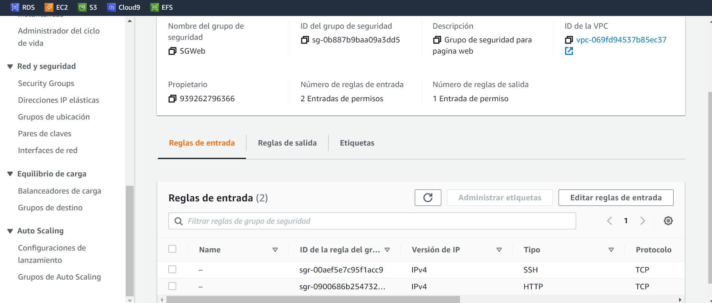

Para el grupo SGEfs, crearemos la siguiente regla de entrada:
- Una regla tipo NFS en el puerto 2049

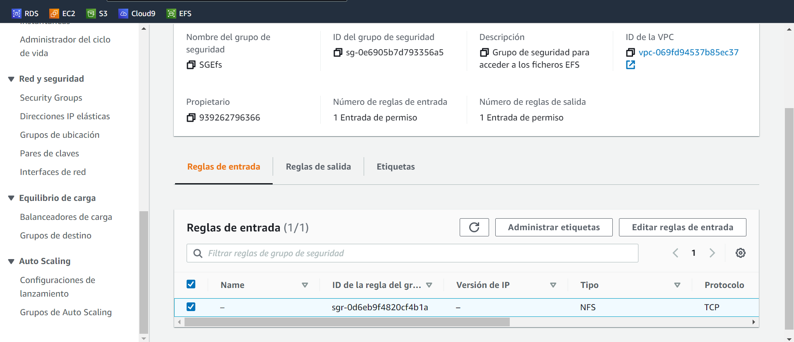

A continuación crearemos las dos instancias EC2, aunque también podríamos haberlas creado antes de los grupos de seguridad.

**2. Creación EC2**

Vamos a crear dos instancias EC2 de la siguiente forma:
- AMI Amazon Linux
- Tipo t2.micro
- Configuraciones de red
  - VPC predeterminada
  - Subred con zona de disponibilidad us-east-1a en una máquina, y zona de disponibilidad us-east-1b en la otra
  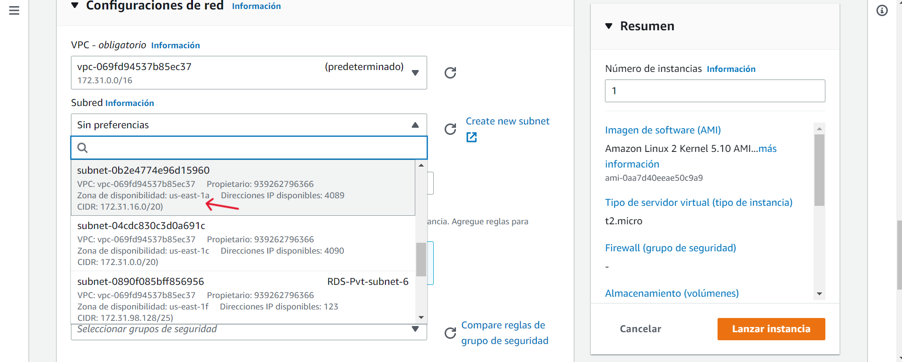
  - Habilitar asignación de IP pública automáticamente
  - Almacenamiento por defecto
  - Seleccionar grupo de seguridad existente SGWeb (aquí podríamos haber creado uno nuevo en caso de no crearlo anteriormente).
  - En Detalles avanzados --> Datos de usuario, insertaremos los siguientes comandos para la instalación automática de estos al crear nuestras EC2 (también pueden insertarse al arrancar la máquina si no introducimos nada en este paso):
    - #!/bin/bash
    - yum update -y
    - yum install httpd -y
    - systemctl start httpd
    - systemctl enable httpd
    - yum -y install nfs-utils

A continuación se muestran las máquinas creadas:

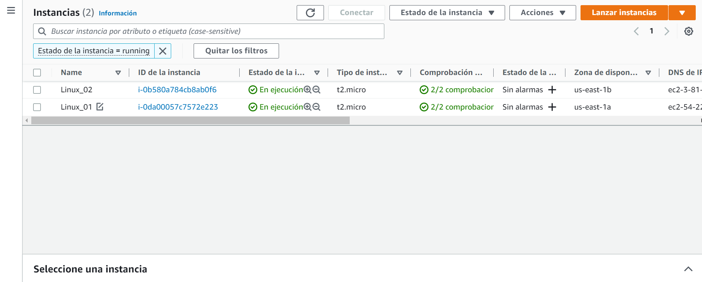

Una vez creadas las EC2, procedemos a crear un sistema de archivos EFS.

**3. Creación EFS**

Para la creación del Efs utilizaremos las siguientes características:

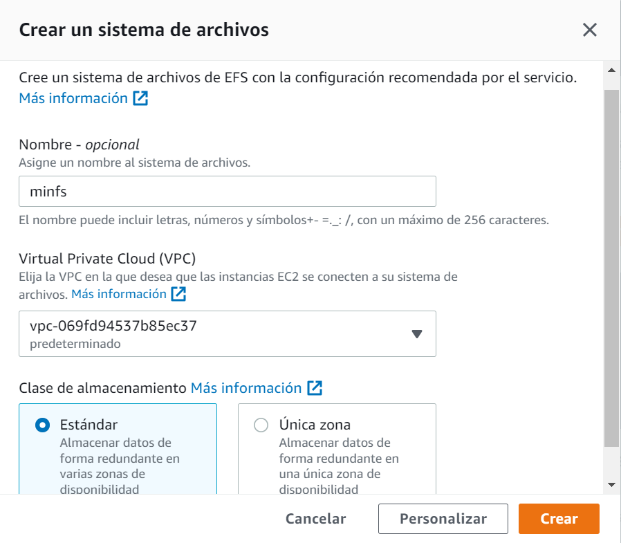

Una vez creada, tenemos que enlazar las zonas de disponibilidad que vamos a utilizar (en este caso, us-east-1a y us-east-1b), con nuestro grupo de seguridad creado anteriormente para Efs.

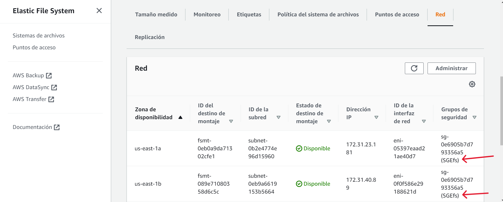

**4. Conexión a las máquinas EC2**

Al crear toda la arquitectura, pasaremos a conectarnos a cada una de las máquinas EC2, de la siguiente forma:

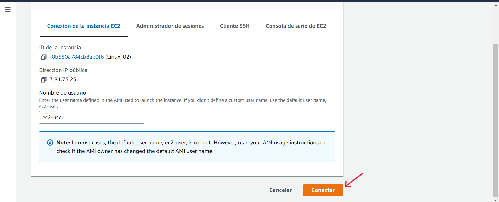

**5. Configuración e instalación página web**

Una vez en la consola de cualquiera de nuestras EC2 (al estar enlazadas los camcios se realizan en ambas máquinas), podemos comprobar el estado de apache para saber si se ha instalado de forma correcta, al introducir los datos de usuario anteriormente:

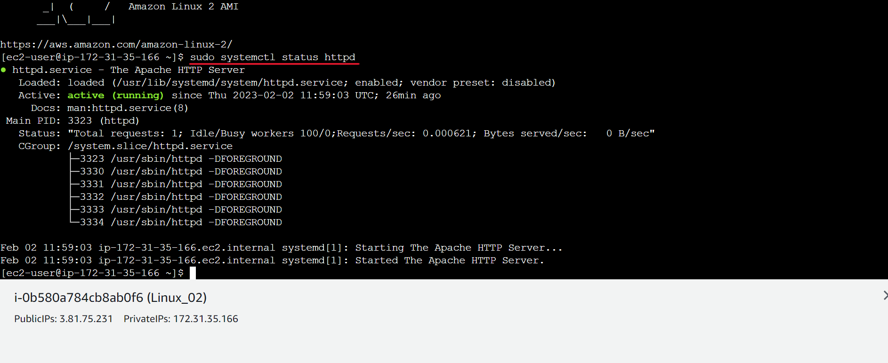

A continuación, vamos a crear el directorio donde se va a almacenar la página web, y posteriormente montaremos el sistema de archivos. Primero accedemos a la ruta *"var/www/html"*, donde crearemos el directorio. Lo creamos y montamos nuestro sistema, mediante los siguientes comandos:

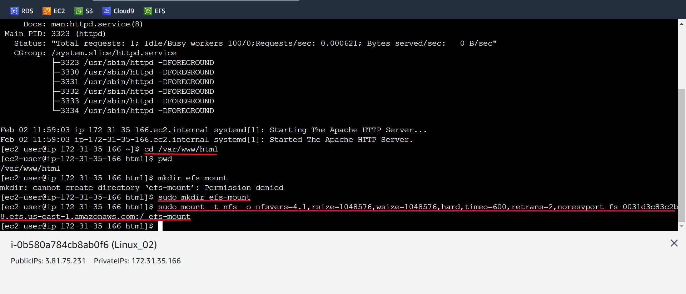

Comprobamos que nuestro sistema de archivos accederá correctamente a la ruta especificada, de la siguiente forma:

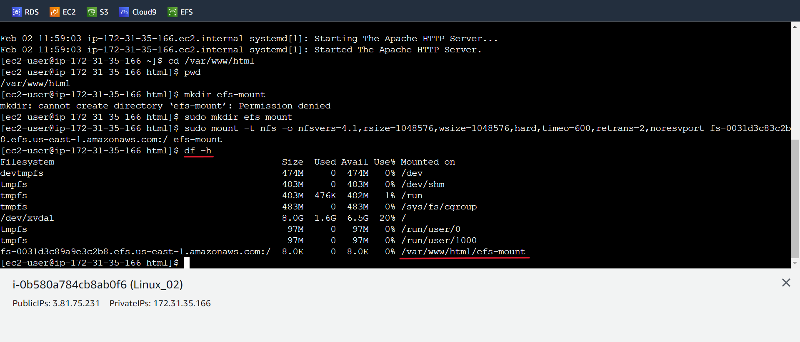

Accedemos al directorio *"efs-mount"*, donde vamos a guardar la página web, y la descargamos:

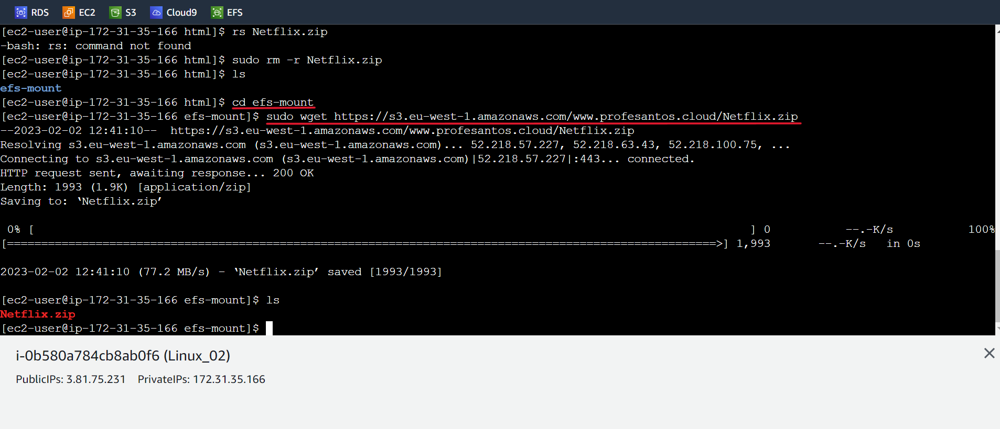

A continuación descomprimimos el archivo zip descargado, dejando en nuestro directorio los archivos necesarios para la página web.

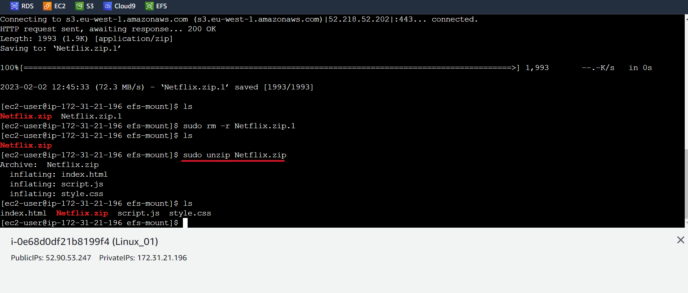

Posteriormente, tenemos que editar el archivo *"httpd.conf"*, de forma que nos permita acceder a la web simplemente introduciendo la dirección IP como url.

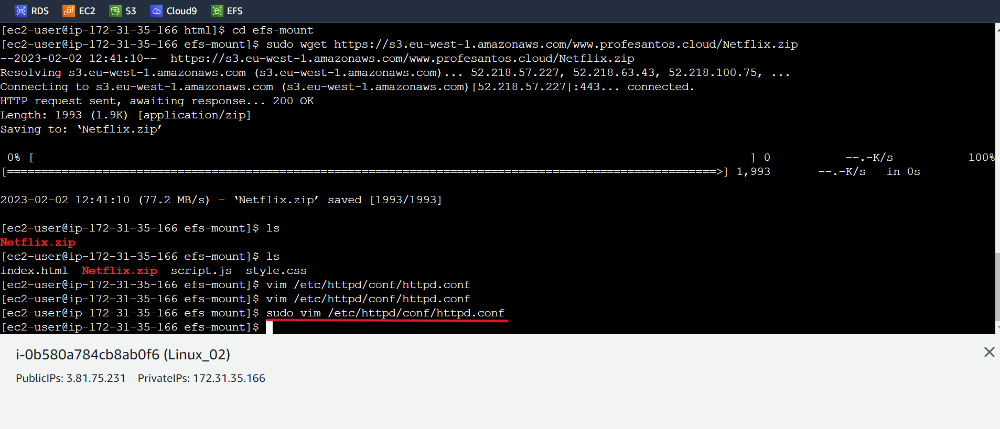

Para ello, cambiaremos la ruta del documento a nuestro directorio *"efs-mount"*:

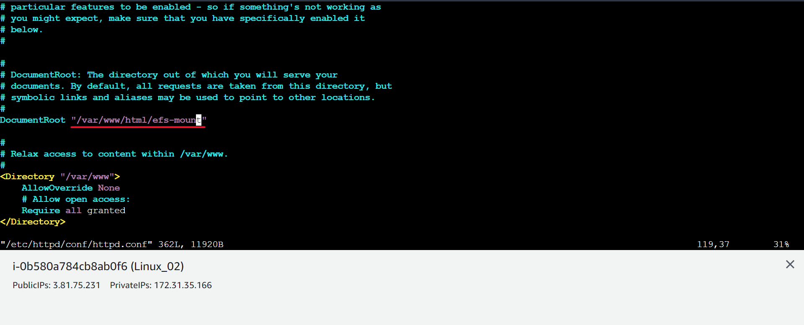

Al editar y guardar los cambios, ya sería posible introducir la dirección IP de cualquiera de nuestras máquinas EC2 en cualquier navegador, y debería dirigirnos a la página web. Con esto ya tenemos montada toda la arquitectura necesaria.

**6. Direcciones IP de instancias EC2**

Balanceador --> **[52.87.23.77](http://52.87.23.77)**
